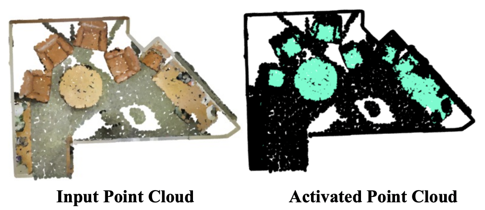

I am currently a forth year PhD student in the Computer Science Department at National Univeristy of Singapore, advised by [Prof. Gim Hee Lee](https://www.comp.nus.edu.sg/cs/people/leegh/). I received my B.E. degree from Tianjin University in 2020. My research interests are 3D scene understanding, low-shot learning and multi-modal understanding.

Email: xu.yating[at]u[dot]nus[dot]edu

Publication List
====================================

Generalized Few-Shot Point Cloud Segmentation Via Geometric Words.
Yating Xu, Conghui Hu, Na Zhao, Gim Hee Lee.
*International Conference on Computer Vision (ICCV), 2023*
[paper](https://arxiv.org/abs/2309.11222)

